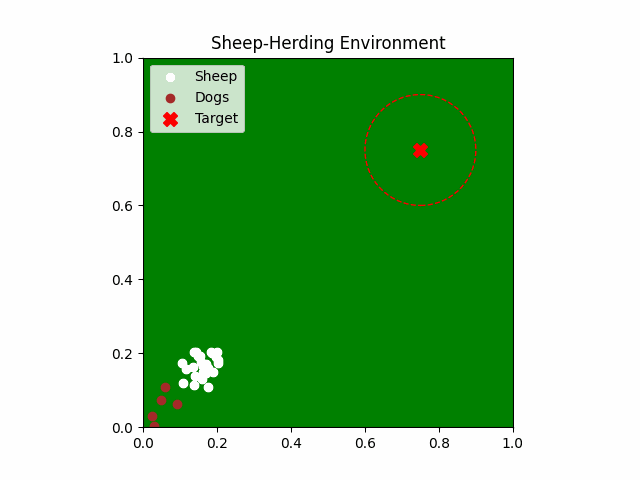
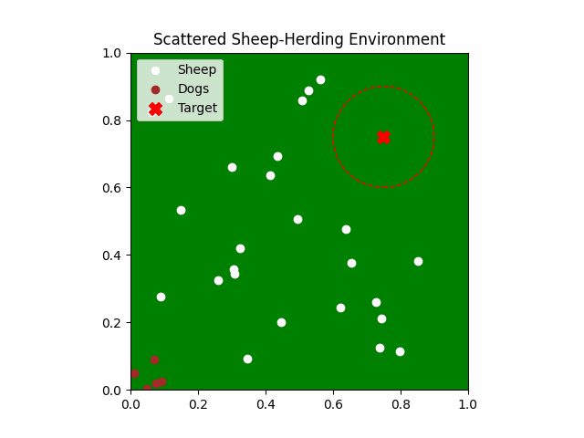
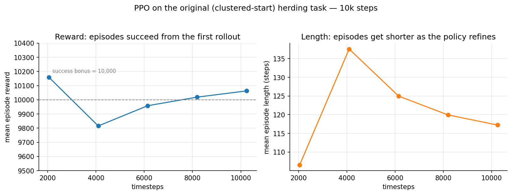
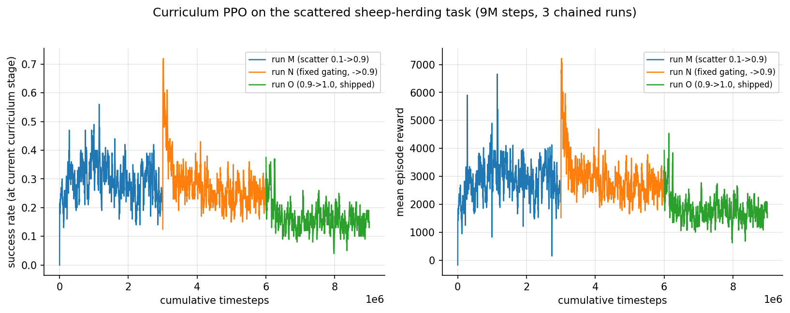

# Multi-Agent Sheep Herding with Reinforcement Learning

A custom multi-agent herding environment where **5 RL-controlled dogs** must gather **25 sheep** and drive them into a target zone — built from scratch on Gymnasium and trained with PPO (Stable-Baselines3).

Two tasks of increasing difficulty:

| Task 1 — sheep start clustered | Task 2 — sheep start scattered |
|:---:|:---:|
|  |  |
| PPO drives the cluster to the target | PPO **gathers** a scattered flock, then **drives** it home |

## The problem

Shepherding is a classic multi-agent control problem: dogs cannot move sheep directly — they can only *repel* them. To move the flock somewhere, a dog has to stand on the **opposite side** of the flock and push it by proximity, and gathering strays means physically circling around them. The policy controls all 5 dogs jointly from a single observation of the whole field, so it must learn spatial coordination (who covers which stray, how to form a driving arc) purely from reward.

- **World**: 1x1 continuous 2D field, target circle of radius 0.15 centered at (0.75, 0.75)
- **Success**: *every* sheep inside the target circle → episode ends with a large bonus
- **Failure**: time limit reached with any sheep outside

## Environment specification

### Observation space

A flat `Box` vector of positions, everything in `[0, 1]` field coordinates:

| Component | Original env | Scattered env |
|---|---|---|
| Sheep positions (x, y) x 25 | 50 dims | 50 dims, **sorted canonically** |
| Dog positions (x, y) x 5 | 10 dims | 10 dims, **sorted canonically** |
| Target position (x, y) | 2 dims | 2 dims |
| Gathered-phase flag | — | 1 dim (0/1, with hysteresis) |
| **Total** | **62 dims** | **63 dims** |

The scattered env sorts the (interchangeable) sheep and dog arrays every step so the MLP doesn't waste capacity learning permutation invariance, and exposes a gather/drive phase bit — 1 bit of memory a feedforward policy cannot infer on its own (details in the findings below).

### Action space

`Box(-10, 10, shape=(10,))` — a `(vx, vy)` velocity command per dog, integrated with `dt = 0.01` and clipped to the field. In the scattered env each action is **held for 10 physics substeps** (action repeat), so an episode is 250 decisions over 2,500 physics steps instead of 2,500 tiny decisions.

### Episode flow

Each step: the policy emits 5 dog velocities → dogs move → every sheep computes its steering response (below) and moves → reward is computed from the new configuration → episode terminates if all sheep are inside the target circle, or truncates at the time limit (1,000 steps original / 250 decisions scattered).

### Dynamics — the update equations

Let $`s_i`$ be sheep $`i`$'s position, $`d_j`$ dog $`j`$'s position, $`T`$ the target, all in $`[0,1]^2`$, with $`\Delta t = 0.01`$.

**Dogs (both tasks)** follow their commanded velocity directly, clipped to the field:

$$d_j \leftarrow \mathrm{clip}\big(d_j + \mathbf{a}_j\,\Delta t,\ 0,\ 1\big), \qquad \mathbf{a}_j \in [-10, 10]^2$$

In the scattered env this update runs $`K{=}10`$ times per policy decision with the same $`\mathbf{a}_j`$ (action repeat). Dogs move up to $0.1$ per substep — 20x faster than sheep.

**Sheep, original task** — pure inverse-square repulsion from *every* dog, no matter how far:

$$\mathbf{v}_i = \sum_{j=1}^{5} \frac{s_i - d_j}{\lVert s_i - d_j\rVert^2 + \varepsilon}, \qquad
s_i \leftarrow \mathrm{clip}\big(s_i + \mathrm{clip}(\mathbf{v}_i, -0.5, 0.5)\,\Delta t,\ 0,\ 1\big)$$

Because $`\lVert\mathbf{v}\rVert = 1/\lVert s_i - d_j\rVert`$ exceeds the 0.5 speed cap whenever a dog is within distance 2 (i.e. anywhere on the unit field), every sheep effectively flees at max speed at all times — fine when the flock only needs to be bulldozed diagonally, fatal for controlled gathering.

**Sheep, scattered task** — repulsion becomes local (radius $`R_{rep}=0.3`$) and a cohesion term is added over neighbours $`N_i = \{k : \lVert s_k - s_i\rVert < 0.2\}`$:

$$\mathbf{v}_i = \underbrace{\sum_{j:\,\lVert s_i - d_j\rVert < R_{rep}} \frac{s_i - d_j}{\lVert s_i - d_j\rVert^2 + \varepsilon}}_{\text{flee nearby dogs}}
\; + \; \underbrace{0.3 \cdot \frac{1}{|N_i|}\sum_{k \in N_i} (s_k - s_i)}_{\text{cohere with neighbours}}$$

then the same speed clip (±0.5) and position update. Sheep outside every dog's radius drift only by cohesion — so dogs must physically reach them, which is what makes gathering a real subtask.

**Flock statistics and the phase flag** (scattered task): with flock center $`c = \frac{1}{25}\sum_i s_i`$ and flock radius $`r = \frac{1}{25}\sum_i \lVert s_i - c\rVert`$, the gathered flag follows a hysteresis rule so it doesn't flip-flop at the boundary:

$$\text{gathered} \leftarrow \begin{cases} \text{True} & r < 0.08 \\ \text{False} & r > 0.12 \\ \text{unchanged} & \text{otherwise} \end{cases}$$

This flag is part of the observation and gates the reward weights below. The 0.08 threshold is deliberate: a flock with mean radius 0.08 physically fits inside the 0.15 target circle; the earlier 0.15 threshold produced flocks that could *never* satisfy the success condition.

### Reward structure

**Original env** (dense shaping toward the fixed target):

| Term | Value |
|---|---|
| Dogs' progress toward target | `prev_dog_dist - dog_dist` |
| Sheep progress toward target | `0.5 x (prev_sheep_dist - sheep_dist)` |
| Flock spread penalty | `-0.5 x flock_radius` |
| Time penalty | `-0.01` per step |
| Per-sheep bonus inside target | `+2` per sheep per step |
| **All sheep inside target** | **+10,000, episode ends** |

As one formula — writing $`\Delta x = x_{prev} - x`$ for one-step progress, with mean distances to the target

$$\bar{D}_{sheep} = \frac{1}{25}\sum_i \lVert s_i - T\rVert, \qquad \bar{D}_{dog} = \frac{1}{5}\sum_j \lVert d_j - T\rVert$$

the per-step reward is:

$$R_t = \Delta \bar{D}_{dog} + 0.5\,\Delta \bar{D}_{sheep} - 0.5\,r_{flock} - 0.01 + 2\,\big|\{i : \lVert s_i - T\rVert < 0.15\}\big|$$

$$R_t = 10{,}000 \ \text{ and episode ends, if } \lVert s_i - T\rVert < 0.15 \ \forall i$$

**Scattered env** (two-phase: gather, then drive — the phase flag gates the weights):

| Term | Collecting phase | Gathered phase |
|---|---|---|
| Gather progress (flock radius shrinking) | `5.0 x` | `5.0 x` |
| Drive progress (flock moving to target) | `2.0 x` | `10.0 x` |
| Dogs' progress toward the **flock** | `1.0 x` | — |
| Dogs near the **driving point** (just beyond the flock, opposite the target — Strömbom-style) | — | `-2.0 x` distance to it |
| Absolute distance penalty | `-1.0 x` mean sheep-to-target distance (both phases) | |
| Flock spread + time | `-0.5 x radius - 0.01` (both phases) | |
| Per-sheep bonus inside target | `+0.2` per sheep per step (kept small — see finding #2) | |
| **All sheep inside target** | **+10,000, episode ends** | |

As one formula (per decision, i.e. per 10 physics substeps), with flock radius $`r`$, flock center $`c`$, and $`n_{in}`$ = number of sheep inside the target circle:

$$R_t = 5\,\Delta r \;+\; w_{drive}\,\Delta \bar{D}_{sheep} \;+\; \Phi_{dog} \;-\; \bar{D}_{sheep} \;-\; 0.5\,r \;-\; 0.01 \;+\; 0.2\,n_{in}$$

where the phase flag selects

$$w_{drive} = \begin{cases} 10 & \text{gathered} \\ 2 & \text{collecting} \end{cases}
\qquad
\Phi_{dog} = \begin{cases} -2 \cdot \frac{1}{5}\sum_j \lVert d_j - P_{drive}\rVert & \text{gathered} \\ \Delta\big(\frac{1}{5}\sum_j \lVert d_j - c\rVert\big) & \text{collecting} \end{cases}$$

and the **driving point** sits just beyond the flock on the side opposite the target (Strömbom's driving position):

$$P_{drive} = \mathrm{clip}\Big(c + \big(r_{max} + 0.08\big)\,\frac{c - T}{\lVert c - T\rVert},\ 0,\ 1\Big)$$

Dogs standing at $`P_{drive}`$ push the flock toward the target purely through the sheep's flee response — the shaping teaches the *positioning*, and the physics does the driving. The absolute $`-\bar{D}_{sheep}`$ term is the anti-stall pressure: without it, a gathered flock parked anywhere is reward-neutral and PPO happily stays there. Success is the same $`+10{,}000`$ terminal bonus, checked every physics substep so a finish mid-decision still counts.

## Task 1 — Original clustered task

Sheep spawn together in a small patch near the dogs' corner; the target is diagonal across the field. Trained with PPO (`MlpPolicy`, lr 1e-3, `clip_range=0.1`, 10k steps).



**Reading the curves**: mean episode reward sits at the +10,000 success bonus from the *first* rollout — this task succeeds almost by construction. With global repulsion and dogs spawning behind the flock, any dog movement pushes the cluster diagonally toward the target; PPO's actual learning shows up in the **episode length** falling from ~137 to ~117 steps as it refines the push. This near-freebie is precisely what motivated building the scattered variant: the interesting parts of shepherding (gathering, flock maintenance, driving position) never get exercised when the geometry does the work for you.

## Task 2 — Scattered task

Sheep spawn uniformly over the whole field (outside the target circle). Now the dogs must cross the field, collect strays into a flock, keep it together, and drive it home — none of which global-repulsion geometry gives for free.

### Training: curriculum PPO

Plain PPO on the full scattered task scores 0% no matter the reward. The winning recipe: sheep start in a small cluster at a **random** location (`scatter_scale = 0.1`) and the scatter widens by 0.05 whenever the recent success rate exceeds ~40%, until the full field. ~9M steps across three chained runs:



(Success rate is measured at the *current* curriculum stage, which is why it saw-tooths downward as stages get harder — each drop is a promotion to a wider scatter.)

### Results (30-episode evaluations, stochastic policy)

| Policy | scatter 0.5 | scatter 0.9 | full scatter |
|---|---|---|---|
| **PPO, curriculum (~9M steps)** | **77%** | 30% | **27%** |
| Scripted shepherd (upper-bound baseline) | — | — | 84% |
| PPO without curriculum / action repeat | — | — | 0% |

The demo GIF above is a real full-scatter success episode: all 25 sheep gathered and delivered in 131 decisions. Evaluate with `deterministic=False` — the stochastic policy herds far better than its deterministic mean (action noise breaks positional deadlocks).

### How we got there (the interesting part)

Every naive approach scored **exactly 0%**. Each plateau exposed a real defect — the full chronological log is in [docs/EXPERIMENT_LOG.md](docs/EXPERIMENT_LOG.md):

1. **Physics was the first bug.** Global `1/dist` repulsion meant any dog pushed *every* sheep at max speed — random dog motion blasted the whole field into a corner. PPO happily learned to pile sheep in the corner and stall there (it was reward-neutral). Fix: local repulsion radius + an absolute distance penalty so parking far away bleeds reward.
2. **Reward exploits are real.** The original env's `+2`/sheep/step in-target bonus out-earned the one-time success reward — the optimal policy would hold one sheep out forever to avoid termination. Caught and cut to `+0.2` before the agent found it.
3. **A 90%-success scripted expert couldn't be imitated.** Behavior cloning underfit badly: the expert assigns dogs to strays combinatorially, and tiny state changes teleport goals between dogs — a function class an MLP cannot represent. Imitation was abandoned for pure RL, informed by why it failed.
4. **Decision density killed exploration.** 2,500 tiny decisions per episode meant PPO's noise never composed into maneuvers. Action repeat (10 substeps per decision) tripled success at every curriculum stage overnight.
5. **Curriculum gating needs hygiene.** The first curriculum over-promoted — episodes still in flight at the easier scale polluted the promotion stats (5 stages in 60k steps). A promotion cooldown and larger evidence window fixed it.

## Repo structure

```
notebooks/   Herding_env.ipynb (original task), Herding_scattered_env.ipynb (scattered task, full pipeline)
src/         scattered_env.py, scripted_expert.py, train.py  — importable versions of the env/baseline/trainer
models/      ppo_sheep_dog.zip (original), ppo_sheep_dog_scattered.zip (scattered, best checkpoint)
assets/      demo GIFs + training curves for both tasks
tensorboard/ original/ and scattered/ (all 15 experiment runs)
docs/        EXPERIMENT_LOG.md — chronological record of every failure and fix
```

## Run it

```bash
pip install -r requirements.txt
# train the scattered task from scratch (several hours on CPU)
python src/train.py --run-name my_run --timesteps 3000000 --curriculum 0.1 \
    --lr 0.0003 --n-steps 256 --batch-size 512 --gamma 0.99 --ent-coef 0.005
# or open either notebook and run cells top to bottom
tensorboard --logdir tensorboard
```

## What's next

The gap to the 84% scripted expert is the flat MLP on a combinatorial multi-agent problem. Ranked next steps: permutation-invariant policy (deep sets / attention over sheep), longer curriculum training, per-dog decentralized policies with shared weights, DAgger with an attention policy.
